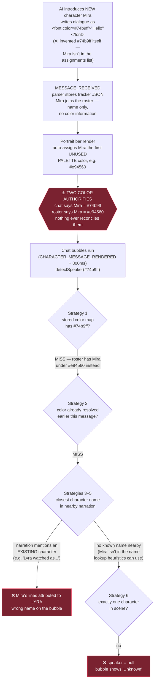
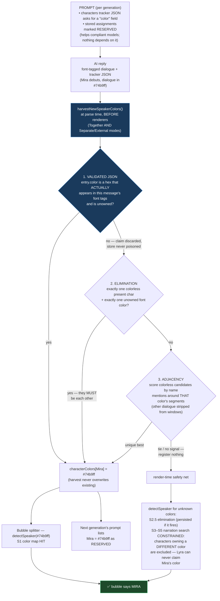

# Dialogue Color → Speaker Attribution

Tracking doc for the oldest bug in DES: **a newly-introduced character gets a
unique dialogue color, but their lines display under an existing character's
name (or "Unknown") instead of their own.**

Status: **reworked fix implemented** (see "The fix" below). The
`test/auto-portraits` branch attempted this and did NOT solve it — its
approach and why it failed are documented below so nobody re-walks that path.
Verify in-browser with the test script at the bottom before closing this out.

---

## How the pipeline works

Three systems each hold an opinion about "which color belongs to which
character", and the bug lives in the gaps between them:

1. **The prompt** (`injector.js` / `promptBuilder.js`) tells the AI to wrap
   dialogue in `` tags and lists the stored color
   assignments for known characters.
2. **The roster** (`characterColors` in settings / chat metadata) is DES's
   stored name → color mapping. The portrait bar auto-assigns a palette
   color to any roster character that doesn't have one.
3. **The bubble splitter** (`chatBubbles.js`) reverse-maps each font color
   back to a speaker name. Its Strategy 1 is the stored color map; when that
   misses, it falls back to guessing from surrounding narration text.

## The bug (pre-fix flow)

Root causes, precisely:

| # | Cause | Where |
|---|---|---|
| 1 | The AI invents a color for a new speaker, but nothing records the (color → name) pair it just created | no harvest step existed |
| 2 | DES independently assigns the new character a *different* palette color, poisoning the stored map | `portraitBar.js` auto-assign |
| 3 | The narration-text fallback can only ever answer with an *already-known* name — for a brand-new speaker it is wrong by construction | `detectSpeaker` strategies 3–5 |

## Why the test/auto-portraits attempt failed

That branch added a `"color"` field to the tracker JSON and harvested it,
trusting the AI's claim. Two fatal holes:

1. **The tracker JSON is written at the START of the reply** — before the
   model has written any dialogue. The declared hex frequently doesn't match
   the font color it actually uses (or is a literal `#RRGGBB` placeholder).
   Trusting it *poisons* the store with colors that never appear in chat.
2. **Its fallback paired colors to names positionally** (first new color ↔
   first colorless character), which mispairs whenever counts don't line up.
3. **The narration fallback stayed unconstrained** — an unknown color could
   still resolve to an existing character who already owns a different
   color, which is the original bug verbatim.

## The fix (current flow)

Nothing trusts the model. Every registration is validated against the
message itself, and impossible attributions are excluded by construction:

### Manual recolors always win

The harvest never overwrites — but a **manual** color change in the
Workshop or Roster always does. When a user replaces a character's color:

- the write goes through the chat-aware store (`getActiveCharacterColors`),
  so it works with per-chat character tracking (two secondary paths wrote
  to the global store and silently no-opped — fixed);
- the replaced hex is kept as a **previous-color alias** on the character's
  roster entry, so historical messages whose font tags still use the old
  color keep attributing to them (aliases are lowest priority — any current
  owner of that hex wins);
- existing bubbles are reverted and re-applied so the change is visible
  immediately.

Plus one more repair on the lookup side: `buildColorToSpeakerMap` is now
built in two passes — absent-but-known characters first, **present characters
second** — so if the AI reuses an absent character's color for someone
on-screen, the present speaker wins the collision instead of the absent one.

### Implementation map

| Piece | File | Role |
|---|---|---|
| `"color"` field in characters tracker JSON + RESERVED/never-reuse instructions | `jsonPromptHelpers.js`, `promptBuilder.js`, `injector.js` | prompt-side nudges (kept from the branch — helpful, but nothing depends on compliance) |
| `harvestNewSpeakerColors()` — validated JSON → elimination → adjacency | `chatBubbles.js` | parse-time registration, validated against the actual message |
| `_bestAdjacentName()` | `chatBubbles.js` | adjacency scoring with other-dialogue-stripped windows |
| Harvest calls in both generation modes | `integration/sillytavern.js`, `generation/apiClient.js` | runs before any renderer |
| `detectSpeaker` S2.5 elimination + color-constrained S3–S5 (`allowed()`) | `chatBubbles.js` | render-time safety net; persists elimination results |
| Two-pass present-overrides-absent map + previous-color alias pass | `chatBubbles.js` (`buildColorToSpeakerMap`) | collision repair + historical attribution after manual recolors |
| Manual overwrite + alias recording + bubble refresh | `characterWorkshop.js`, `characterRoster.js` | user edits always win, chat-aware store |

### What was deliberately kept

- The portrait bar's palette auto-assign stays, as a **last resort** for
  characters that somehow arrive with no color from any source. The harvest
  runs earlier in the pipeline, so in practice it wins the race; the palette
  only fills true gaps.
- `detectSpeaker`'s narration heuristics (strategies 3–5) stay as fallbacks
  for messages with no tracker data at all (old chats, suppressed tracker).

## Known residual risks

- **Several characters debuting in one turn with no adjacency signal**: if
  elimination can't isolate one candidate and adjacency ties, nothing is
  registered — the segment shows "Unknown" rather than guessing wrong. The
  next turn usually disambiguates (fewer remaining unknowns each turn).
- **The AI can still disobey** the never-reuse instruction; the two-pass map
  limits the damage (present speaker wins), but two *present* characters
  sharing a color is unrecoverable until the user fixes one in the Workshop.
- Existing chats whose rosters already contain palette-poisoned colors won't
  self-heal automatically. Fix is now one step: set the right color in the
  Workshop — manual edits overwrite, and the old color stays as an alias so
  history doesn't break.

## In-browser verification script

1. Fresh chat with dialogue coloring + chat bubbles + portrait bar on.
2. Let the AI introduce a brand-new named character mid-conversation.
3. Check, in order:
   - System Log shows `Registered 1 new speaker color: <Name> → #...` —
     `(validated JSON)`, `(elimination)`, or `(adjacency)` shows which path
     fired.
   - The new character's bubble shows **their own name**, not another
     character's, not "Unknown".
   - Portrait bar card color dot matches the dialogue color in chat.
   - Context Inspector → next generation's dialogue-coloring prompt lists
     the new character in the RESERVED assignments.
4. Introduce TWO new characters in one reply — both should attribute
   correctly via the JSON path.
5. Have an absent character's color get reused by the AI for someone present
   (hard to force; if observed, the present character must win the bubble).
6. Recolor an existing character in the Workshop → portrait dot and
   re-rendered bubbles use the new color immediately; their OLD messages
   still attribute to them (alias); next generation's RESERVED list shows
   the new hex. Repeat with per-chat character tracking enabled.
